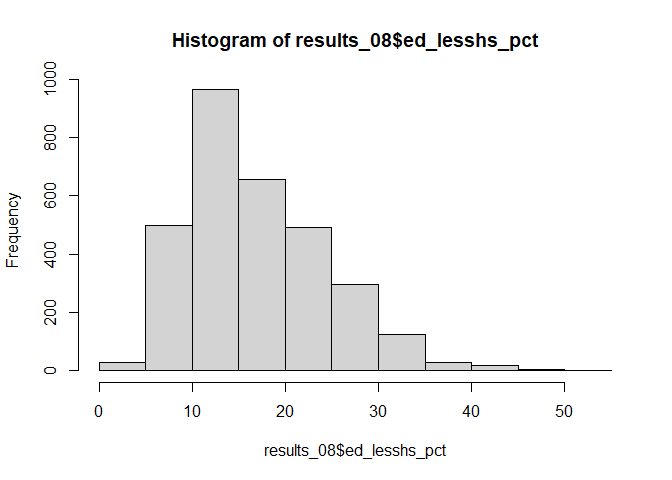

Geog4/6300: Lab 6
================

## Correlation and ANOVA

**Value:** 30 points

**Overview** In this lab, you’ll work with county level election and
census data to answer two questions: (1) how did association between the
presidential vote (measured by vote for the Republican candidate) and
educational attainment change between 2008 and 2016 and (2) Were there
regional differences in the vote for the Republican candidate across
years? To do so, you’ll need to prepare a dataset for analysis and run
chi-square, ANOVA, and post-hoc (TukeyHSD) tests.

Our dataset is drawn from the American Community Survey and [this Github
repository](https://github.com/tonmcg/US_County_Level_Election_Results_08-16)
giving the votes by county in 2008, 2012, and 2016. The ACS data are the
pooled five-year samples for 2006-10, 2010-14, and 2014-18 respectively.
Let’s load the data from the lab folder:

``` r
election_data<-read_csv("data/elections0816_demog_pct.csv")
```

    ## Parsed with column specification:
    ## cols(
    ##   .default = col_double(),
    ##   gisjn_cty = col_character(),
    ##   county = col_character(),
    ##   state = col_character(),
    ##   region = col_character(),
    ##   division = col_character(),
    ##   year_txt = col_character()
    ## )

    ## See spec(...) for full column specifications.

The raw population counts and rates (percentages) are both included in
this dataset. You can see a description of the variables in the
setup/census\_vars.csv variables.

### Part 1: Correlation analysis

In this section, you’ll be measuring the correlation between the
gop\_pct (% voting for the Republican) variable and the five variables
showing *highest* level of educational attainment as a rate:

*ed\_lesshs\_pct: % of population with less than a high school diploma
*ed\_hsdiploma\_pct: % of population with a high school diploma/GED
*ed\_lessba\_pct: % of population with some college or an associate’s
degree *ed\_ba\_pct: % of population with a bachelor’s degree
\*ed\_graddeg\_pct: % of population with a professional/graduate degree

To start with, you will need to subset the data to two separate data
frames, one for the 2008 election results and one for 2016.

**Question 1 (2 points)** *Create these two data frames using the
year\_txt variable and subset for just the region variable (Census
region) as well as our variables of interest (GOP voting and educational
attainment). Call the heads of both using kable when you are done.*

``` r
results_08<-election_data%>%
  filter(year_txt == "Y2008")%>%
  select(region, ed_lesshs_pct, ed_hsdiploma_pct, ed_lessba_pct, ed_ba_pct, ed_graddeg_pct, gop_pct)
head(results_08)
```

    ## # A tibble: 6 x 7
    ##   region ed_lesshs_pct ed_hsdiploma_pct ed_lessba_pct ed_ba_pct ed_graddeg_pct
    ##   <chr>          <dbl>            <dbl>         <dbl>     <dbl>          <dbl>
    ## 1 Midwe~          9.45             38.4          33.5     18.7            6.01
    ## 2 South~         18.5              30.0          29.0     22.5            5.87
    ## 3 South~         24.5              35.7          30.2      9.66           2.76
    ## 4 South~         47.2              29.1          16.1      7.60           1.94
    ## 5 West ~         11.9              34.0          34.8     19.3            6.92
    ## 6 Midwe~         13.1              38.6          31.9     16.3            3.11
    ## # ... with 1 more variable: gop_pct <dbl>

``` r
results_16<-election_data%>%
  filter(year_txt == "Y2016")%>%
  select(region, ed_lesshs_pct, ed_hsdiploma_pct, ed_lessba_pct, ed_ba_pct, ed_graddeg_pct, gop_pct)
head(results_16)
```

    ## # A tibble: 6 x 7
    ##   region ed_lesshs_pct ed_hsdiploma_pct ed_lessba_pct ed_ba_pct ed_graddeg_pct
    ##   <chr>          <dbl>            <dbl>         <dbl>     <dbl>          <dbl>
    ## 1 Midwe~          6.07             33.3          39.1     14.7            6.83
    ## 2 South~         17.8              33.3          29.4     14.5            4.97
    ## 3 South~         19.1              37.1          32.2      7.17           4.40
    ## 4 South~         36.1              27.6          25.5      7.81           2.97
    ## 5 West ~          5.58             28.0          43.3     14.4            8.76
    ## 6 Midwe~          9.97             36.0          34.7     14.0            5.31
    ## # ... with 1 more variable: gop_pct <dbl>

**Question 2 (4 points)** *Next you should assess the normality of the
variables of interest. Use a histogram and Shapiro-Wilk test to do so
for the 2016 data. Based on your results, is a parametric or
non-parametric test needed?*

``` r
shapiro.test(results_08$ed_lesshs_pct)
```

    ## 
    ##  Shapiro-Wilk normality test
    ## 
    ## data:  results_08$ed_lesshs_pct
    ## W = 0.95452, p-value < 2.2e-16

``` r
shapiro.test(results_08$ed_hsdiploma_pct)
```

    ## 
    ##  Shapiro-Wilk normality test
    ## 
    ## data:  results_08$ed_hsdiploma_pct
    ## W = 0.99178, p-value = 2.304e-12

``` r
shapiro.test(results_08$ed_lessba_pct)
```

    ## 
    ##  Shapiro-Wilk normality test
    ## 
    ## data:  results_08$ed_lessba_pct
    ## W = 0.99866, p-value = 0.01274

``` r
shapiro.test(results_08$ed_ba_pct)
```

    ## 
    ##  Shapiro-Wilk normality test
    ## 
    ## data:  results_08$ed_ba_pct
    ## W = 0.88122, p-value < 2.2e-16

``` r
shapiro.test(results_08$ed_graddeg_pct)
```

    ## 
    ##  Shapiro-Wilk normality test
    ## 
    ## data:  results_08$ed_graddeg_pct
    ## W = 0.89035, p-value < 2.2e-16

``` r
shapiro.test(results_08$gop_pct)
```

    ## 
    ##  Shapiro-Wilk normality test
    ## 
    ## data:  results_08$gop_pct
    ## W = 0.99223, p-value = 6.283e-12

``` r
hist(results_08$ed_lesshs_pct)
```

<!-- -->

``` r
hist(results_08$ed_hsdiploma_pct)
```

<!-- -->

``` r
hist(results_08$ed_lessba_pct)
```

<!-- -->

``` r
hist(results_08$ed_ba_pct)
```

<!-- -->

``` r
hist(results_08$ed_graddeg_pct)
```

<!-- -->

``` r
hist(results_08$gop_pct)
```

<!-- -->

``` r
shapiro.test(results_16$ed_lesshs_pct)
```

    ## 
    ##  Shapiro-Wilk normality test
    ## 
    ## data:  results_16$ed_lesshs_pct
    ## W = 0.93478, p-value < 2.2e-16

``` r
shapiro.test(results_16$ed_hsdiploma_pct)
```

    ## 
    ##  Shapiro-Wilk normality test
    ## 
    ## data:  results_16$ed_hsdiploma_pct
    ## W = 0.99336, p-value = 9.539e-11

``` r
shapiro.test(results_16$ed_lessba_pct)
```

    ## 
    ##  Shapiro-Wilk normality test
    ## 
    ## data:  results_16$ed_lessba_pct
    ## W = 0.99847, p-value = 0.005087

``` r
shapiro.test(results_16$ed_ba_pct)
```

    ## 
    ##  Shapiro-Wilk normality test
    ## 
    ## data:  results_16$ed_ba_pct
    ## W = 0.94158, p-value < 2.2e-16

``` r
shapiro.test(results_16$ed_graddeg_pct)
```

    ## 
    ##  Shapiro-Wilk normality test
    ## 
    ## data:  results_16$ed_graddeg_pct
    ## W = 0.81118, p-value < 2.2e-16

``` r
shapiro.test(results_16$gop_pct)
```

    ## 
    ##  Shapiro-Wilk normality test
    ## 
    ## data:  results_16$gop_pct
    ## W = 0.95141, p-value < 2.2e-16

``` r
hist(results_16$ed_lesshs_pct)
```

<!-- -->

``` r
hist(results_16$ed_hsdiploma_pct)
```

<!-- -->

``` r
hist(results_16$ed_lessba_pct)
```

<!-- -->

``` r
hist(results_16$ed_ba_pct)
```

<!-- -->

``` r
hist(results_16$ed_graddeg_pct)
```

<!-- -->

``` r
hist(results_16$gop_pct)
```

<!-- -->

Based on the results above, I will be using a non-parametric test. The
p-values for each shapiro-wilk test came back as less than 0.05
(significant). The corresponding histograms show that many of the
distributions are relatively normal but to compensate for those that are
not, I will use the Spearman test.

**Question 3 (4 points)** *Now you can assess correlation in each year.
Use the rcorr variable from the Hmisc package to analyze the correlation
of our variables of interest in 2008 and 2016 using the Pearson or
Spearman’s test (depending on normality). Save the results of each
function to an object and then call it in your code so it is visible in
this knitted lab document.*

``` r
cor_prep08<-results_08%>%
  select(-region, gop_pct, ed_lesshs_pct:ed_graddeg_pct)
election_cor08<-rcorr(as.matrix(cor_prep08), type="spearman")
election_cor08
```

    ##                  ed_lesshs_pct ed_hsdiploma_pct ed_lessba_pct ed_ba_pct
    ## ed_lesshs_pct             1.00             0.22         -0.59     -0.71
    ## ed_hsdiploma_pct          0.22             1.00         -0.39     -0.66
    ## ed_lessba_pct            -0.59            -0.39          1.00      0.35
    ## ed_ba_pct                -0.71            -0.66          0.35      1.00
    ## ed_graddeg_pct           -0.49            -0.58          0.24      0.79
    ## gop_pct                   0.16             0.16          0.03     -0.23
    ##                  ed_graddeg_pct gop_pct
    ## ed_lesshs_pct             -0.49    0.16
    ## ed_hsdiploma_pct          -0.58    0.16
    ## ed_lessba_pct              0.24    0.03
    ## ed_ba_pct                  0.79   -0.23
    ## ed_graddeg_pct             1.00   -0.21
    ## gop_pct                   -0.21    1.00
    ## 
    ## n= 3110 
    ## 
    ## 
    ## P
    ##                  ed_lesshs_pct ed_hsdiploma_pct ed_lessba_pct ed_ba_pct
    ## ed_lesshs_pct                  0.0000           0.0000        0.0000   
    ## ed_hsdiploma_pct 0.0000                         0.0000        0.0000   
    ## ed_lessba_pct    0.0000        0.0000                         0.0000   
    ## ed_ba_pct        0.0000        0.0000           0.0000                 
    ## ed_graddeg_pct   0.0000        0.0000           0.0000        0.0000   
    ## gop_pct          0.0000        0.0000           0.0569        0.0000   
    ##                  ed_graddeg_pct gop_pct
    ## ed_lesshs_pct    0.0000         0.0000 
    ## ed_hsdiploma_pct 0.0000         0.0000 
    ## ed_lessba_pct    0.0000         0.0569 
    ## ed_ba_pct        0.0000         0.0000 
    ## ed_graddeg_pct                  0.0000 
    ## gop_pct          0.0000

``` r
cor_prep16<-results_16%>%
  select(-region, gop_pct, ed_lesshs_pct:ed_graddeg_pct)
election_cor16<-rcorr(as.matrix(cor_prep16), type="spearman")
election_cor16
```

    ##                  ed_lesshs_pct ed_hsdiploma_pct ed_lessba_pct ed_ba_pct
    ## ed_lesshs_pct             1.00             0.32         -0.46     -0.72
    ## ed_hsdiploma_pct          0.32             1.00         -0.35     -0.72
    ## ed_lessba_pct            -0.46            -0.35          1.00      0.24
    ## ed_ba_pct                -0.72            -0.72          0.24      1.00
    ## ed_graddeg_pct           -0.53            -0.62          0.03      0.73
    ## gop_pct                   0.18             0.40          0.07     -0.35
    ##                  ed_graddeg_pct gop_pct
    ## ed_lesshs_pct             -0.53    0.18
    ## ed_hsdiploma_pct          -0.62    0.40
    ## ed_lessba_pct              0.03    0.07
    ## ed_ba_pct                  0.73   -0.35
    ## ed_graddeg_pct             1.00   -0.45
    ## gop_pct                   -0.45    1.00
    ## 
    ## n= 3111 
    ## 
    ## 
    ## P
    ##                  ed_lesshs_pct ed_hsdiploma_pct ed_lessba_pct ed_ba_pct
    ## ed_lesshs_pct                  0.0000           0.0000        0.0000   
    ## ed_hsdiploma_pct 0.0000                         0.0000        0.0000   
    ## ed_lessba_pct    0.0000        0.0000                         0.0000   
    ## ed_ba_pct        0.0000        0.0000           0.0000                 
    ## ed_graddeg_pct   0.0000        0.0000           0.1422        0.0000   
    ## gop_pct          0.0000        0.0000           0.0002        0.0000   
    ##                  ed_graddeg_pct gop_pct
    ## ed_lesshs_pct    0.0000         0.0000 
    ## ed_hsdiploma_pct 0.0000         0.0000 
    ## ed_lessba_pct    0.1422         0.0002 
    ## ed_ba_pct        0.0000         0.0000 
    ## ed_graddeg_pct                  0.0000 
    ## gop_pct          0.0000

**Question 4 (2 points)** *Look at the results of your correlation
matrix for 2016. Evaluate the correlation between the GOP vote and the
educational attainment variables, focusing on direction, magnitude and
significance.*

There appears to be a statistically significant correlation between
every level of education. However, the direction and magnitude of each
relationship differs. There is a positive correlation between those with
lower levels of education attainment and GOP voters (HS diploma or
less). Conversely, there appears to be a negative correlation between
those with high level of educational attainment and GOP voters (BA or
higher).

**Question 5 (2 points)** *Use the tidy function from broom to transform
the results of the rcorr function in question 3 to a data frame format.
Filter this to just include results showing correlation with the GOP
vote in each county and add a new column that gives the year for each
dataset. Then combine these two datasets using bind\_rows or rbind. Call
the head of the table when you are done.*

``` r
library(knitr)
cor_values08<-tidy(election_cor08) %>%
  filter(column1=="gop_pct")%>%
  mutate(year=2008)

kable(head(cor_values08))
```

| column1  | column2            |    estimate |    n |   p.value | year |
| :------- | :----------------- | ----------: | ---: | --------: | ---: |
| gop\_pct | ed\_lesshs\_pct    |   0.1624567 | 3110 | 0.0000000 | 2008 |
| gop\_pct | ed\_hsdiploma\_pct |   0.1628847 | 3110 | 0.0000000 | 2008 |
| gop\_pct | ed\_lessba\_pct    |   0.0341534 | 3110 | 0.0568537 | 2008 |
| gop\_pct | ed\_ba\_pct        | \-0.2321868 | 3110 | 0.0000000 | 2008 |
| gop\_pct | ed\_graddeg\_pct   | \-0.2067774 | 3110 | 0.0000000 | 2008 |

``` r
cor_values16<-tidy(election_cor16)%>%
  filter(column1=="gop_pct")%>%
  mutate(year=2016)

kable(head(cor_values16))
```

| column1  | column2            |    estimate |    n |   p.value | year |
| :------- | :----------------- | ----------: | ---: | --------: | ---: |
| gop\_pct | ed\_lesshs\_pct    |   0.1781951 | 3111 | 0.0000000 | 2016 |
| gop\_pct | ed\_hsdiploma\_pct |   0.3989550 | 3111 | 0.0000000 | 2016 |
| gop\_pct | ed\_lessba\_pct    |   0.0671934 | 3111 | 0.0001765 | 2016 |
| gop\_pct | ed\_ba\_pct        | \-0.3509089 | 3111 | 0.0000000 | 2016 |
| gop\_pct | ed\_graddeg\_pct   | \-0.4460689 | 3111 | 0.0000000 | 2016 |

``` r
cor_final<-bind_rows(cor_values08,cor_values16)
kable(head(cor_final))
```

| column1  | column2            |    estimate |    n |   p.value | year |
| :------- | :----------------- | ----------: | ---: | --------: | ---: |
| gop\_pct | ed\_lesshs\_pct    |   0.1624567 | 3110 | 0.0000000 | 2008 |
| gop\_pct | ed\_hsdiploma\_pct |   0.1628847 | 3110 | 0.0000000 | 2008 |
| gop\_pct | ed\_lessba\_pct    |   0.0341534 | 3110 | 0.0568537 | 2008 |
| gop\_pct | ed\_ba\_pct        | \-0.2321868 | 3110 | 0.0000000 | 2008 |
| gop\_pct | ed\_graddeg\_pct   | \-0.2067774 | 3110 | 0.0000000 | 2008 |
| gop\_pct | ed\_lesshs\_pct    |   0.1781951 | 3111 | 0.0000000 | 2016 |

**Question 6 (2 points)** *Create a ladder plot (similar to the one
shown in the class code that shows the change in correlation coefficient
between 2008 and 2016 for each subgroup in this analysis (e.g., those
without a diploma, those with a diploma only).*

``` r
ggplot(cor_final, aes(x=year, y=estimate, group=column2, color=column2))+
  geom_line()+
  geom_point()
```

<!-- -->

**Question 7 (2 points)** *Interpret the graph you created in question
6. How did the associations between educational attainment and vote for
the Republican candidate change between 2008 and 2016? Focus on the
direction and magnitude of this change.*

It appears that the percentage of those who attained less than a
bachelor’s degree or less than a high school diploma decreased ever so
slightly while the percentage of those who attained a high school
diploma increase a significant amount. It would also appear that the
percentage of people who pursued bachelor’s degree or other higher-level
degree decreased.

### Part 2: ANOVA

In this section you’ll calculate the change in vote for the Republican
candidate by county and then use ANOVA/post-hoc tests to determine if
these changes differed across the four U.S. Census regions.

To start with, you’ll need to calculate that change in vote.

**Question 8 (2 points)** *Subset the initial dataset you loaded at the
start of this lab so it includes just the region, year\_txt, and
gop\_pct variables. Transform this data so the years are wide
(individual columns) rather than long. Then calculate the change in
percent of Republican vote between 2008 and 2016. Call the head of your
table when done.*

``` r
gop<-election_data%>%
  select(region, year_txt, gop_pct, fips_code)%>%
  pivot_wider(names_from = year_txt, values_from = gop_pct)%>%
  mutate(avg_change = Y2016 - Y2008)

kable(head(gop))
```

| region         | fips\_code |    Y2008 |    Y2012 |    Y2016 | avg\_change |
| :------------- | ---------: | -------: | -------: | -------: | ----------: |
| Midwest Region |      26041 | 45.96622 | 52.83489 | 60.17220 |  14.2059800 |
| South Region   |      48295 | 87.02229 | 89.38356 | 87.67020 |   0.6479037 |
| South Region   |       1127 | 72.32305 | 75.91325 | 82.78220 |  10.4591553 |
| South Region   |      48389 | 46.96133 | 41.33240 | 44.50377 | \-2.4575571 |
| West Region    |      56017 | 72.03456 | 75.91182 | 76.48915 |   4.4545878 |
| Midwest Region |      20043 | 66.55443 | 71.14871 | 77.27273 |  10.7182940 |

**Question 9 (3 points)** *Create a boxplot that shows the distribution
of the vote change variable you just created in question 6 by census
region. Describe two notable trends shown by this graph.*

``` r
ggplot(gop, aes(x=region, y=avg_change))+
  geom_boxplot()
```

    ## Warning: Removed 1 rows containing non-finite values (stat_boxplot).

<!-- -->

There appears to have been a notable change in voting sentiment in both
the southern and western regions. This is made evident by the large
number of outliers outside of the IQR of both plots. Midwestern voters
appear to have been further polarized based on the number of outliers on
either side of the plot.

**Question 10 (4 points)** *Let’s assume the change variable is normally
distributed. Do an ANOVA analysis of that variable across regions and
call the results. Then run a TukeyHSD test on the output as a post-hoc
test.*

``` r
anova_test<-aov(gop$avg_change ~ gop$region, gop)
summary(anova_test)
```

    ##               Df Sum Sq Mean Sq F value Pr(>F)    
    ## gop$region     3  31409   10470     287 <2e-16 ***
    ## Residuals   3106 113306      36                   
    ## ---
    ## Signif. codes:  0 '***' 0.001 '**' 0.01 '*' 0.05 '.' 0.1 ' ' 1
    ## 1 observation deleted due to missingness

``` r
TukeyHSD(anova_test)
```

    ##   Tukey multiple comparisons of means
    ##     95% family-wise confidence level
    ## 
    ## Fit: aov(formula = gop$avg_change ~ gop$region, data = gop)
    ## 
    ## $`gop$region`
    ##                                       diff       lwr        upr     p adj
    ## Northeast Region-Midwest Region -5.1050598 -6.262474 -3.9476459 0.0000000
    ## South Region-Midwest Region     -5.9318137 -6.562996 -5.3006318 0.0000000
    ## West Region-Midwest Region      -8.6815111 -9.579012 -7.7840102 0.0000000
    ## South Region-Northeast Region   -0.8267538 -1.958218  0.3047101 0.2376267
    ## West Region-Northeast Region    -3.5764513 -4.875423 -2.2774794 0.0000000
    ## West Region-South Region        -2.7496974 -3.613475 -1.8859200 0.0000000

**Question 11 (3 points)** *Based on the analysis you did in question
10, was the change in Republican vote between 2008 and 2016 different
between geographic regions? If so, which regions appear to be different
from each other? Use the box plot you created in question 9 to describe
the direction of difference as well as significance (e.g., which regions
were higher or lower than others.*

The percentage of Southern GOP voters increased and the percentage of
Western GOP voters decreased. The only comparison made where the
findings were NOT significant was between the southern and northeastern
regions. The Northeast and Midwest differ in that midwestern voters
tended to vote differently than they had previously while Northeastern
voters appear to be more consistent with regards to which political
party they voted for. The south and midwest are similar in that voter
polarization worsened. The greatest level of difference is between the
midwestern and western regions. Western voters were much more likely to
vote for the democrat’s candidate than for the republican’s. The
southern and northeastern regions had the smallest level of difference
between eachother but the p-value is not significant.NOrtheastern voters
appear to be more conservative than their counterparts in the west. I
find it interesting that the greatest level of difference was not
between the southern and western regions despite notable differences in
public sentiment and the political leanings of the masses.

According to the data, there appears to be a conclusive shift in voter
sentiment from one election to the next. This finding makes sense given
the state of society as of 11/6/2020. Americans are more divided than
ever and the data proves it.
